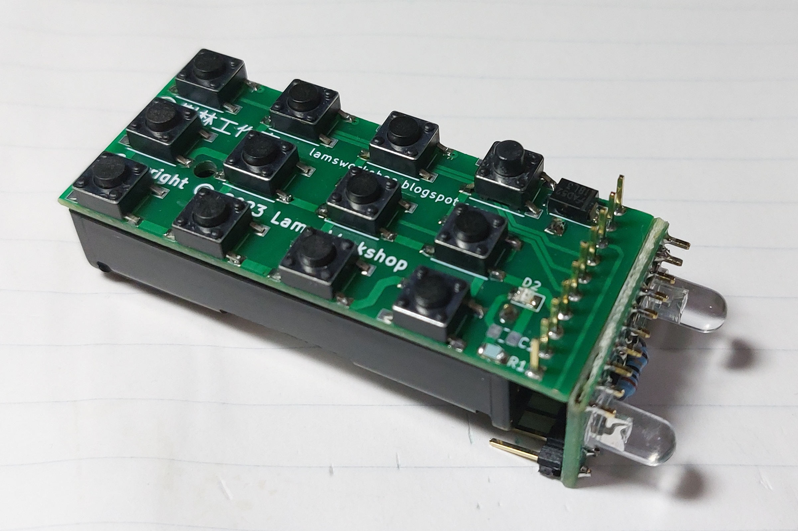

# Programmable IR Remote Controller

- 12 keys (1 shift-key + 11 ordinary keys)
- 1 LED indicator
- 1 IR photo-transistor
- 2 IR LED
- UART
- UPDI
- support 12 devices
- each device has 22 keys (11 ordinary + 11 shifted)
- LEARN mode (read IR signal and send mark/space intervals to UART)
- programmable through UART (upgrade firmware / upload lookup table)
- SLEEP mode (sleeps when idle: LED off and not sending IR signals)

# Key index
|  IR LED | IR SENSOR  |  IR LED |
| :------------: | :------------: | :------------: |
|**(shift)**||LED|
|**11**| 0  | 10  |
| 1  | 2  | 3  |
|  4 |  5 | 6  |
| 7  | 8  |  9 |

# Modes and Operation

## CONTROL Mode
- click key#11 (shift-key) to toggle LED
- LED will turn off when no key is pressed in 5 seconds
- click other keys to send out IR signals. 22 signals supported.
- double click shift-key to enter LEARN mode
- hold key#7 and click key#10 to enter BOOTLOADER mode.
- sleeps when idle

## LEARN Mode
- LED blinks slow
- won't sleep
- aim the remote to read close to the IR sensor (between the two IR LED)
- mark and space will be sent to UART. (reading times 24 us)
- zero space means time overflow
- click any keys to return to CONTROL Mode. key clicked determines the device to use.

## BOOTLOADER Mode
- LED blinks fast
- won't sleep

# Device and Key Table

<table style='text-align:center'>
<tr><th></th><th>#0</th><th>#1</th><th>#2</th><th>#3</th><th>#4</th><th>#5</th><th>#6</th><th>#7</th><th>#8</th><th>#9</th><th>#10</th></tr>
<tr><td>EXTENDED 0x8EC0</td><td>device#0 or device#8</td><td>device#1 or device#9</td><td>device#2 or device#10</td><td>device#3 or device#11</td><td>device#4</td><td>device#5</td><td>device#6</td><td>device#7</td></tr>
<tr><td>device#0 0x8EC8</td><td colspan=11>ordinary keys</td></tr>
<tr><td /><td colspan=11>shifted keys</td></tr>
<tr><td /><td>null-char</td><td>address</td><td colspan=2>protocol</td></tr>
<tr><td>device#1 0x8EE2</td><td colspan=11>ordinary keys</td></tr>
</table>

- Table starts from 0x8EC0 to 0x8FFF
- null-char is normally 0xff

# IR PROTOCOLS
- built and uploaded separated from main codes
- occupies memory 0xA00 to 0xEBF (code space)
